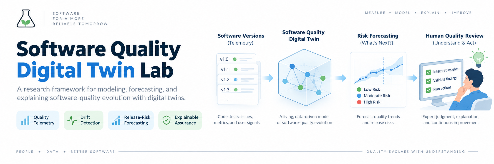
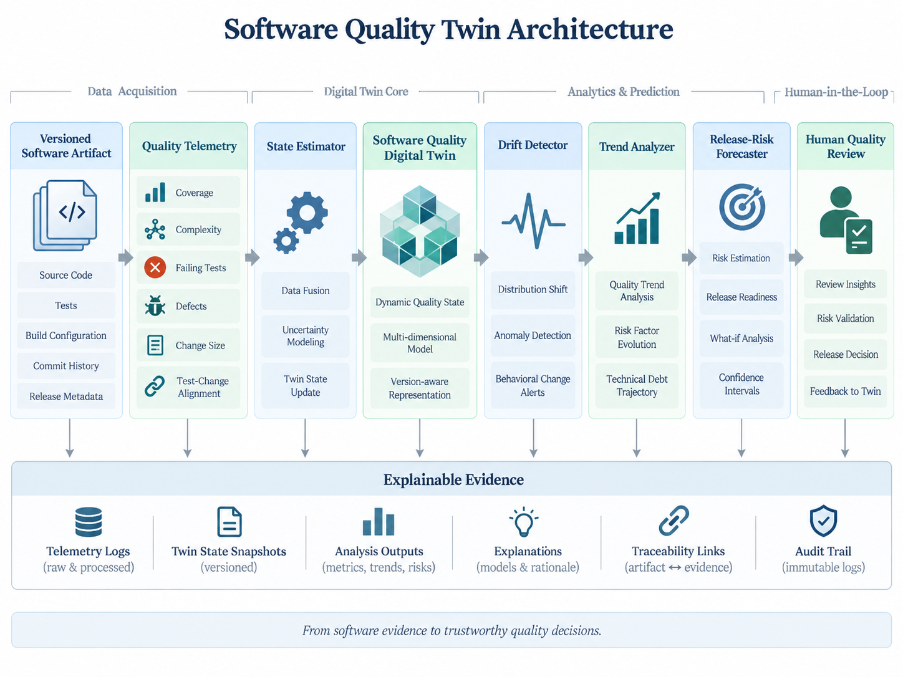
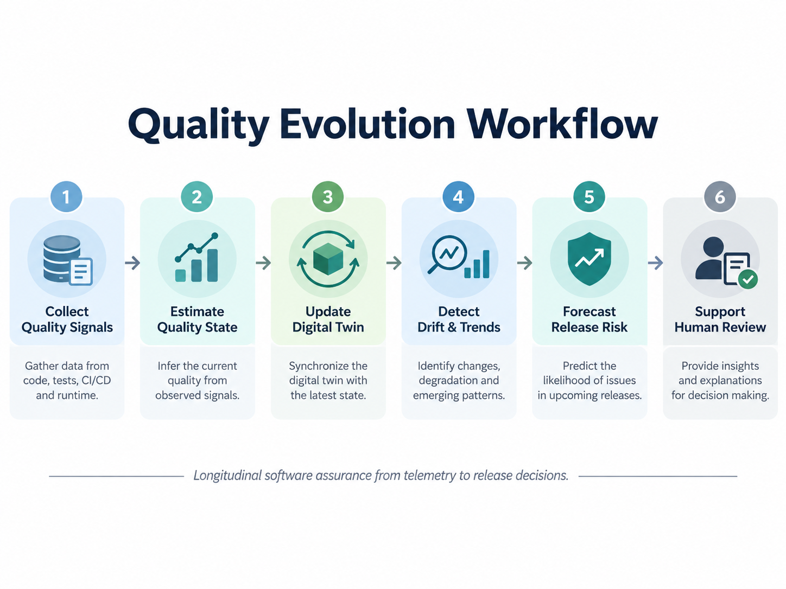
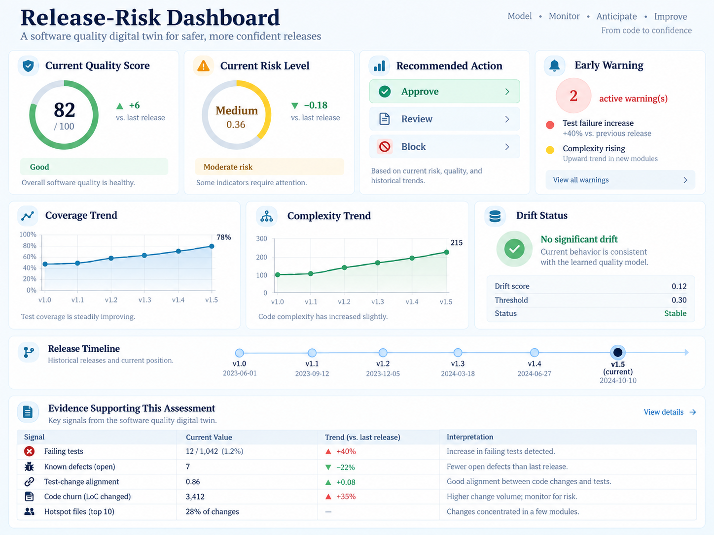

<p align="center">
  
</p>

<h1 align="center">Software Quality Digital Twin Lab</h1>

<p align="center"><b>A research framework for modeling, forecasting, and explaining software-quality evolution with digital twins.</b></p>

## Overview

Software Quality Digital Twin Lab explores whether a continuously updated digital representation of software quality can help detect degradation, forecast release risk, and support evidence-based quality assurance before failures become visible in production.

The project treats a software-quality digital twin as a **versioned quality-state model** built from observable engineering evidence such as code change, test coverage, complexity, defect signals, CI outcomes, and release history. The current research focus is not only present-state classification, but whether **longitudinal context provides earlier and safer quality warnings than static current-version checks**.

## Core Research Question

> **Can a software-quality digital twin detect meaningful quality degradation and forecast release risk early enough to improve continuous software assurance while remaining explainable and empirically reproducible?**

## Research Goals

- model software-quality state over time;
- fuse heterogeneous quality telemetry into an auditable twin state;
- detect quality drift between software versions;
- identify sustained degradation before absolute thresholds are crossed;
- forecast release-readiness risk using current state and recent trajectory;
- distinguish degradation, stability, and recovery;
- explain which evidence and trend features drove each forecast;
- compare longitudinal reasoning against credible static baselines;
- evaluate unsafe under-calls, false warnings, and early-warning behavior;
- test robustness to missing, stale, and noisy telemetry;
- support reproducible longitudinal SQA experiments.

## Digital Twin Concept

<p align="center">
  
</p>

```text
Software version
     ↓
Quality telemetry
     ↓
State estimator
     ↓
Versioned Quality Twin
     ↓
┌───────────────────────────────┐
│ Current-state risk            │
│ Version-to-version drift      │
│ Rolling quality trend         │
│ Recovery / degradation state  │
└───────────────────────────────┘
     ↓
History-aware release forecast
     ↓
Explainable review recommendation
     ↓
Human quality review
```

## Current Quality Signals

The initial prototype represents:

- test coverage;
- change complexity;
- failing tests;
- defect count;
- change size;
- test-change alignment.

These signals are intentionally transparent so the contribution of longitudinal history can be measured before introducing larger statistical or machine-learning models.

## Longitudinal Intelligence

<p align="center">
  
</p>

The twin now preserves version history and computes a rolling trajectory assessment from recent quality states.

For every trend window it records:

- mean version-to-version quality delta;
- cumulative quality-score change;
- consecutive decline count;
- degradation status;
- recovery status.

A sustained decline can escalate an otherwise low-risk current state from `approve` to `review`. This is deliberate: it creates a testable mechanism for evaluating whether a quality twin can surface degradation **before** static thresholds classify the current version as risky.

The release forecast also produces a transparent one-step quality-score projection based on the recent mean trend. This is a baseline forecasting mechanism, not a claim that software quality follows a simple linear process.

## Multi-Trajectory Benchmark

The research benchmark now evaluates qualitatively different longitudinal behaviors instead of relying on one monotonic degradation history.

Current trajectory families include:

- stable healthy evolution;
- gradual quality erosion;
- sudden regression;
- post-degradation recovery;
- test-change misalignment.

Each trajectory is evaluated separately against the static threshold baseline and the longitudinal twin. The benchmark reports risk accuracy, ordinal error, unsafe undercalls, early warnings, false warnings, recovery detection, and per-version predictions.

Run it with:

```bash
python benchmarks/run_trajectory_suite.py
```

Or export a machine-readable experiment artifact:

```bash
python benchmarks/run_trajectory_suite.py \
  --trend-window 4 \
  --output results/trajectory-suite.json
```

See [`docs/trajectory-benchmark-protocol.md`](docs/trajectory-benchmark-protocol.md) for interpretation rules and threats to validity.

## Research Contributions

| Contribution | Purpose |
|---|---|
| Quality-state model | Represent the software system as a versioned quality twin. |
| Telemetry fusion | Combine heterogeneous SQA evidence into one auditable state. |
| Quality drift detection | Identify meaningful change between consecutive versions. |
| Trend analysis | Measure cumulative degradation, repeated decline, and recovery across version windows. |
| History-aware release forecasting | Test whether longitudinal context provides earlier warning than current-state thresholds alone. |
| Safety-oriented metrics | Measure ordinal error and unsafe risk under-calls, not only raw accuracy. |
| Early-warning metrics | Measure warning sensitivity and false-warning burden before future risk increases. |
| Multi-trajectory evaluation | Separate stable, gradual, sudden, recovery, and test-misalignment behaviors. |
| Telemetry robustness | Study sensitivity to missing, noisy, stale, and imputed quality evidence. |
| Evidence assurance | Distinguish software-quality risk from confidence in the evidence supporting it. |
| Static baseline comparison | Compare the twin against a transparent current-version SQA comparator. |
| Explainability | Preserve the evidence and trajectory responsible for each forecast. |

## Release-Risk Dashboard Concept

<p align="center">
  
</p>

The dashboard concept brings together quality score, risk level, recommended release action, early warnings, coverage and complexity trends, drift status, release history, and the evidence supporting each assessment.

## Experimental Comparison

The project is designed around four conditions:

| Condition | Information available |
|---|---|
| Static threshold SQA | Current telemetry only |
| Current-state twin | Current telemetry transformed into a versioned quality state |
| Longitudinal twin | Current state + recent history + trend |
| Longitudinal twin + explanation | Same forecast with evidence and trajectory rationale exposed to reviewers |

The project should only claim benefit from longitudinal modeling when experiments show measurable incremental value over the simpler conditions.

## Evaluation Metrics

Implemented evaluation currently includes:

- exact risk-classification accuracy;
- mean ordinal risk error;
- unsafe undercall rate;
- early-warning rate;
- false-warning rate;
- risk flip rate under telemetry perturbation;
- unsafe flip rate under telemetry perturbation;
- mean and maximum quality-score deviation;
- per-trajectory recovery detection.

The broader evaluation plan also covers drift lead time, calibration, reviewer verification accuracy, review workload, and external validation on independently sourced software histories.

## Quick Start

```bash
git clone https://github.com/Hirakhyzer/software-quality-digital-twin-lab.git
cd software-quality-digital-twin-lab
python -m venv .venv
source .venv/bin/activate  # Windows: .venv\\Scripts\\activate
python -m pip install -e ".[dev]"
python examples/run_demo.py
pytest
python benchmarks/run_longitudinal_benchmark.py
python benchmarks/run_trajectory_suite.py
python benchmarks/run_telemetry_robustness.py
```

## Repository Structure

```text
software-quality-digital-twin-lab/
├── .github/workflows/python-check.yml
├── .gitignore
├── CITATION.cff
├── LICENSE
├── README.md
├── assets/
│   ├── banner.png.png
│   ├── software-quality-twin-architecture.png.png
│   ├── quality-evolution-workflow.png.png
│   └── release-risk-dashboard.png.png
├── benchmarks/
│   ├── run_longitudinal_benchmark.py
│   ├── run_trajectory_suite.py
│   └── run_telemetry_robustness.py
├── data/
│   ├── quality_history.json
│   └── trajectory_suite.json
├── docs/
│   ├── evaluation-methodology.md
│   ├── longitudinal-forecasting-study.md
│   ├── research-framework.md
│   ├── research-gap.md
│   ├── telemetry-robustness-study.md
│   └── trajectory-benchmark-protocol.md
├── examples/
│   └── run_demo.py
├── src/software_quality_twin/
│   ├── baselines.py
│   ├── drift.py
│   ├── evaluation.py
│   ├── evidence_assurance.py
│   ├── forecasting.py
│   ├── schema.py
│   ├── state_estimator.py
│   ├── telemetry_quality.py
│   ├── trend.py
│   └── twin.py
└── tests/
    ├── test_longitudinal_evaluation.py
    ├── test_trajectory_suite.py
    └── test_twin.py
```

## Research Boundary

This repository is a research prototype. It does not autonomously approve production releases or replace accountable software-quality professionals. Its purpose is to study measurable quality-state modeling, forecasting, drift, trajectory analysis, evidence quality, and human-interpretable assurance.

The current scoring rules, synthetic labels, perturbations, and trend thresholds are experimental parameters. They are not universal definitions of software quality and must be validated, sensitivity-tested, and frozen before held-out evaluation.

## Reproducibility

Experiments should record:

- software version and trajectory identifier;
- input telemetry;
- twin state and quality score;
- drift and trend configuration;
- trend-window length;
- release forecast and confidence;
- explanation and warning state;
- baseline result;
- expected outcome;
- evaluation metrics;
- model or threshold version;
- random seed where applicable.

See [`docs/evaluation-methodology.md`](docs/evaluation-methodology.md), [`docs/longitudinal-forecasting-study.md`](docs/longitudinal-forecasting-study.md), [`docs/telemetry-robustness-study.md`](docs/telemetry-robustness-study.md), and [`docs/trajectory-benchmark-protocol.md`](docs/trajectory-benchmark-protocol.md) for the current research protocols.

## Citation

Research-software citation metadata is provided in [`CITATION.cff`](CITATION.cff). GitHub-compatible citation tooling can use this file to generate a citation for the repository.

## License

Released under the [MIT License](LICENSE).

## Author

Created by **Hira Khyzer** as a software quality assurance and digital-twin research project.
